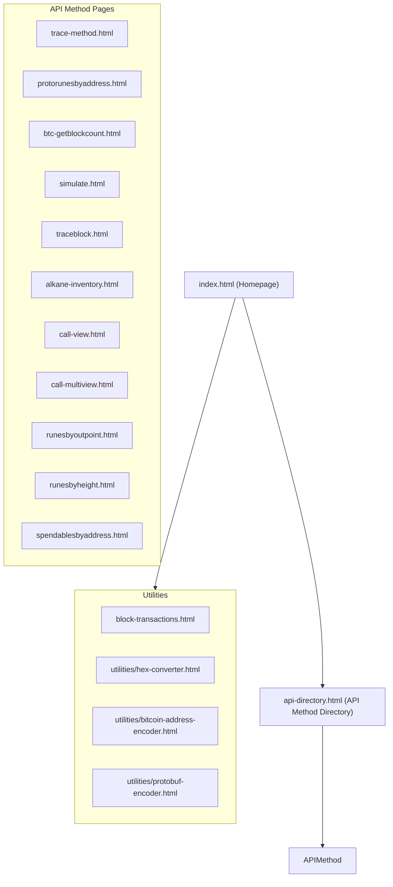

# METHANE Product Requirements Document (PRD)

## 1. Project Overview

METHANE (Method Exploration, Testing, and Analysis eNvironment) is a developer-focused tool for exploring and testing Metashrew API methods, with specific support for Alkanes and Protorunes functionality. The platform serves as both detailed documentation and an interactive testing environment for blockchain developers.

### 1.1 Project Purpose

To provide a clean, comprehensive, and accessible interface for developers to:
- Explore all available Metashrew API methods
- Test API calls with real, working examples from Bitcoin mainnet
- Toggle between PRODUCTION and LOCAL environments
- Access detailed documentation of parameters, responses, and use cases

## 2. Site Structure



### 2.1 Homepage (index.html)

The homepage serves as the main entry point to the application and should include:

1. **Header Section**
   - Project title and description
   - Main navigation links
   - Quick access to API Method Directory

2. **Latest Block Information**
   - Current block height
   - Sync status
   - Last update timestamp

3. **Events Stream Visual**
   - Horizontal stream of the latest Alkanes transactions
   - Transactions ordered by their index within blocks
   - Compact representation showing only essential information
   - Interactive elements to expand for more details
   - Links to detailed transaction/block pages

4. **Quick Start Guide**
   - Brief instructions for using the platform
   - Links to example pages and tutorials

5. **API Category Sections**
   - Grouped method links by functionality
   - Brief descriptions of each category
   - Visual indicators for commonly used methods

## 3. Page Components

Each API method page must include the following standard components:

### 3.1 Required Components

1. **Header Section**
   - Method name and description
   - Purpose and primary use cases
   - API endpoint information

2. **Endpoint Toggle Component**
   - Toggle switch between PRODUCTION and LOCAL environments
   - Visual indicator of current selection
   - Status display showing connection health

3. **Method Documentation**
   - Clear description of parameters
   - Parameter types and validation rules
   - Return value description
   - Error handling information

4. **Example Section (Tabs)**
   - Request example (with valid parameters)
   - Response example (complete and accurate)
   - cURL command example (functional)

5. **Interactive Testing Form**
   - Input fields for all required parameters
   - Submit button to execute the API call
   - Response display area
   - Error handling and validation

6. **Real Mainnet Examples**
   - At least one fully documented example with transaction ID
   - Valid input parameters that produce meaningful output
   - Links to block explorer for context (where applicable)

7. **Protobuf Utility Section**
   - For methods that use Protocol Buffers as input (like protorunesbyaddress)
   - Input form to generate Protocol Buffer encoding
   - Copy button for encoded output
   - Clear explanation of how to use the encoded output in API calls
   - Visual representation of the Protocol Buffer message structure

### 3.2 Component Details

#### Endpoint Toggle Component
```html
<div class="endpoint-toggle-container">
  <div class="endpoint-toggle">
    <span class="endpoint-label">Endpoint:</span>
    <button class="toggle-button production active">PRODUCTION</button>
    <button class="toggle-button local">LOCAL</button>
  </div>
  <div class="endpoint-status">
    <span class="status-label">Status:</span>
    <span class="status-value">Checking...</span>
  </div>
</div>
```

#### Example Tabs Structure
```html
<div class="examples-container">
  <div class="example-tabs">
    <button class="example-tab active" data-target="request-example">Request</button>
    <button class="example-tab" data-target="response-example">Response</button>
    <button class="example-tab" data-target="curl-example">cURL</button>
  </div>
  
  <div class="example-content active" id="request-example">
    <!-- Request JSON example -->
  </div>
  
  <div class="example-content" id="response-example">
    <!-- Response JSON example -->
  </div>
  
  <div class="example-content" id="curl-example">
    <!-- cURL command example -->
  </div>
</div>
```

#### Events Stream Visual Structure (Homepage)
```html
<div class="events-stream-container horizontal">
  <div class="stream-header">
    <h3>Latest Alkanes Transactions</h3>
    <div class="stream-controls">
      <div class="stream-filter">
        <select id="transaction-type" class="compact-select">
          <option value="all">All Types</option>
          <option value="contract-creation">Contract Creation</option>
          <option value="token-transfer">Token Transfer</option>
          <option value="contract-call">Contract Call</option>
        </select>
      </div>
      <a href="block-transactions.html" class="view-all-link">View All</a>
    </div>
  </div>
  
  <div class="horizontal-timeline">
    <!-- Transaction events displayed horizontally -->
    <div class="scroll-container">
      <div class="events-row">
        <!-- Example event cards -->
        <div class="event-card" data-txid="2916ef626dec24de64a01e80582b2634096f939efce46dfa9d1b4699d67af8e5" data-block="887300" data-index="12">
          <div class="card-header">
            <span class="event-type-badge contract-creation">Contract</span>
            <span class="event-block">Block 887300</span>
          </div>
          <div class="card-body">
            <div class="txid-container">2916...f8e5</div>
            <div class="event-stats">
              <span class="stat-item"><i class="icon-gas"></i> 123k</span>
              <span class="stat-item"><i class="icon-index"></i> #12</span>
            </div>
          </div>
          <div class="card-footer">
            <a href="trace-method.html?txid=2916ef626dec24de64a01e80582b2634096f939efce46dfa9d1b4699d67af8e5" class="details-link">View Details</a>
          </div>
        </div>
        
        <!-- More event cards... -->
        <div class="event-card" data-txid="8a71ef122ac24de64a01e80582b2634096f939efce46dfa9d1b4699d67a1234" data-block="887301" data-index="3">
          <div class="card-header">
            <span class="event-type-badge token-transfer">Transfer</span>
            <span class="event-block">Block 887301</span>
          </div>
          <div class="card-body">
            <div class="txid-container">8a71...1234</div>
            <div class="event-stats">
              <span class="stat-item"><i class="icon-gas"></i> 45k</span>
              <span class="stat-item"><i class="icon-index"></i> #3</span>
            </div>
          </div>
          <div class="card-footer">
            <a href="trace-method.html?txid=8a71ef122ac24de64a01e80582b2634096f939efce46dfa9d1b4699d67a1234" class="details-link">View Details</a>
          </div>
        </div>
      </div>
    </div>
    <button class="scroll-button left"><i class="icon-left"></i></button>
    <button class="scroll-button right"><i class="icon-right"></i></button>
  </div>
</div>
```

#### Events Stream Visual Structure (Detailed View)
```html
<div class="events-stream-container">
  <h3>Block Transactions Stream</h3>
  <div class="stream-controls">
    <div class="stream-filter">
      <label for="transaction-type">Filter by type:</label>
      <select id="transaction-type">
        <option value="all">All Transactions</option>
        <option value="contract-creation">Contract Creation</option>
        <option value="token-transfer">Token Transfer</option>
        <option value="contract-call">Contract Call</option>
      </select>
    </div>
    
    <div class="stream-stats">
      <div class="stat-item">
        <span class="stat-label">Total Transactions:</span>
        <span class="stat-value" id="total-tx-count">0</span>
      </div>
      <div class="stat-item">
        <span class="stat-label">Total Gas Used:</span>
        <span class="stat-value" id="total-gas-used">0</span>
      </div>
    </div>
  </div>
  
  <div class="events-timeline">
    <div class="timeline-header">
      <div class="header-cell">Index</div>
      <div class="header-cell">Transaction</div>
      <div class="header-cell">Type</div>
      <div class="header-cell">Gas Used</div>
      <div class="header-cell">Status</div>
    </div>
    
    <div class="timeline-body">
      <!-- Transaction events will be dynamically populated here -->
      <!-- Example structure for a transaction event: -->
      <div class="transaction-event" data-txid="2916ef626dec24de64a01e80582b2634096f939efce46dfa9d1b4699d67af8e5" data-index="12">
        <div class="event-index">12</div>
        <div class="event-txid">2916...f8e5</div>
        <div class="event-type contract-creation">Contract Creation</div>
        <div class="event-gas">123,456</div>
        <div class="event-status success">Success</div>
        
        <div class="event-details">
          <div class="event-chain">
            <!-- Visual representation of the events chain -->
            <div class="event-node">Contract Creation</div>
            <div class="event-arrow">↓</div>
            <div class="event-node">Token Minting</div>
            <div class="event-arrow">↓</div>
            <div class="event-node">Event Emission</div>
          </div>
          
          <button class="view-trace-btn">View Full Trace</button>
        </div>
      </div>
      <!-- More transaction events... -->
    </div>
  </div>
  
  <div class="timeline-pagination">
    <button id="load-more-events">Load More</button>
  </div>
</div>
```

#### Protobuf Utility Section Structure
```html
<div class="protobuf-utility-container">
  <h3>Protocol Buffer Utility</h3>
  <div class="protobuf-description">
    <p>This method requires Protocol Buffer encoded input. Use this utility to generate valid encoded input from your parameters.</p>
  </div>
  
  <div class="protobuf-form">
    <!-- Dynamically generated form based on the method's protobuf structure -->
    <div class="form-group">
      <label for="pb-address">Bitcoin Address:</label>
      <input type="text" id="pb-address" placeholder="Enter Bitcoin address">
    </div>
    
    <div class="form-group">
      <label for="pb-protocol-tag">Protocol Tag (optional):</label>
      <input type="number" id="pb-protocol-tag" placeholder="Default: 1">
    </div>
    
    <button id="generate-protobuf" class="btn btn-primary">Generate Encoded Input</button>
  </div>
  
  <div class="protobuf-output">
    <h4>Encoded Output:</h4>
    <div class="code-display">
      <pre id="encoded-output">// Encoded output will appear here</pre>
      <button id="copy-encoded" class="btn btn-sm">Copy</button>
    </div>
  </div>
  
  <div class="protobuf-usage">
    <h4>How to Use This Encoded Output</h4>
    <p>The encoded output can be used directly in the "params" array of your JSON-RPC call:</p>
    <pre>
{
  "method": "metashrew_view",
  "params": [
    "protorunesbyaddress",
    "<span class="highlight">YOUR_ENCODED_OUTPUT</span>",
    "latest"
  ],
  "id": 0,
  "jsonrpc": "2.0"
}
    </pre>
  </div>
</div>
```

## 4. Method-Specific Requirements

### 4.1 Core Alkanes Methods

#### trace-method.html
- Real example: Transaction ID "2916ef626dec24de64a01e80582b2634096f939efce46dfa9d1b4699d67af8e5"
- Parameters: outpoint (transaction ID and output index)
- Response: Binary trace data with detailed explanation

#### simulate.html
- Real example: MessageContextParcel with sample transaction data
- Detailed parameter breakdown of MessageContextParcel structure
- Gas usage and execution results

#### traceblock.html
- Real example: Block height 887384
- Examples showing multiple transaction traces
- Visual representation of block structure if possible
- **Transactions Events Stream Visual**: 
  - Reference to the main Events Stream Visual on the homepage
  - Option to view all transactions from this specific block
  - More detailed transaction information than the homepage view
  - All other features from the detailed Events Stream Visual structure

#### alkane-inventory.html
- Real example: Address with known token holdings
- Token balance display with descriptions
- Transaction history context

#### call-view.html
- Real example: Contract with view functions
- Parameters: Alkane ID, inputs vector, fuel limit
- Raw response data explained

#### call-multiview.html
- Real example: Multiple view calls in one request
- Batch operation explanation
- Performance benefits highlighted

### 4.2 Protorune Compatibility Methods

#### protorunesbyaddress.html
- Real example: Address with Protorune holdings
- Complete wallet response with balances
- Token metadata display

#### protorunesbyoutpoint.html
- Real example: Transaction with token transfers
- UTXO exploration with token data
- Transaction context

#### protorunesbyheight.html
- Real example: Block with token minting/transfers
- Token activity summary
- Block context information

#### spendablesbyaddress.html
- Real example: Address with spendable outputs
- UTXO listing with token information
- Wallet interface context

### 4.3 Core Bitcoin Methods

#### btc-getblockcount.html
- Current blockchain height
- Sync status information
- Block progression context

### 4.4 Protocol Buffer Methods

The following methods use Protocol Buffers for their input format and should include the Protobuf Utility Section:

#### protorunesbyaddress.html
- Required Protocol Buffer fields: address (string), protocol_tag (optional uint64)
- Utility should generate encoded hex output with both fields
- Mapping to `encodeProtorunesWalletInput` function in alkanes-rpc.js
- Example: Address "bc1p3cyx5e2hgh53w7kpxcvm8s4kkega9gv5wfw7c4qxsvxl0u8x834qf0u2dp" with protocol tag 1

#### protorunesbyoutpoint.html
- Required Protocol Buffer fields: txid (bytes), vout (uint32)
- Utility should convert txid from hex to appropriate bytes format
- Mapping to `encodeTraceRequest` function in alkanes-rpc.js
- Example: txid "2916ef626dec24de64a01e80582b2634096f939efce46dfa9d1b4699d67af8e5" with vout 0

#### runesbyaddress.html
- Required Protocol Buffer fields: address (string)
- Utility should generate encoded hex output with single field
- Mapping to `encodeWalletInput` function in alkanes-rpc.js
- Example: Address "bc1p3cyx5e2hgh53w7kpxcvm8s4kkega9gv5wfw7c4qxsvxl0u8x834qf0u2dp"

#### spendablesbyaddress.html
- Required Protocol Buffer fields: address (string)
- Identical encoding to runesbyaddress
- Utility should clearly explain the difference in purpose
- Example: Address with known UTXO history

#### trace-method.html
- Required Protocol Buffer fields: txid (bytes), vout (uint32)
- Identical encoding to protorunesbyoutpoint
- Utility should convert txid from hex string to bytes
- Example: txid "2916ef626dec24de64a01e80582b2634096f939efce46dfa9d1b4699d67af8e5" with vout 0

## 5. Real Example Requirements

Each method page must include:

1. **Fully Functional Examples**
   - Transaction IDs from Bitcoin mainnet
   - Block heights with relevant data
   - Addresses with token holdings

2. **Complete Request/Response Pairs**
   - Valid input parameters
   - Actual response data
   - Formatted for readability

3. **Context Information**
   - When the data was created/found
   - Block explorer links
   - Related transactions/blocks

## 6. Technical Requirements

### 6.1 API Integration

- All API calls must follow standardized format:
```javascript
{
  "method": "method_name",
  "params": [],
  "id": 0,
  "jsonrpc": "2.0"
}
```

- Headers must only include: `'Content-Type': 'application/json'`
- NO Project ID header should be used
- Endpoint URL: `https://mainnet.sandshrew.io/v2/lasereyes` (PRODUCTION)
- Local URL configurable through .env file

### 6.2 Frontend Requirements

- Minimal use of component libraries
- Pure HTML/CSS/JS for maximum compatibility
- Semantic HTML for better AI traversability
- Mobile-responsive design
- Accessible components

### 6.3 Endpoint Toggle Functionality

- Visual indication of current endpoint
- Persistent state between page navigation
- Status indicator showing endpoint health
- Error handling for connection issues

## 7. Method Implementation Matrix

| Method Name | Template | Real Example | Endpoint Toggle | Interactive Form | Status |
|-------------|----------|--------------|-----------------|------------------|--------|
| trace-method | ✅ | ✅ | ✅ | ✅ | Needs REVIEW AND TESTING, NOT FULLY FUNCTIONAL |
| simulate | ✅ | ❌ | ❌ | ❌ | Needs implementation |
| traceblock | ✅ | ❌ | ❌ | ❌ | Needs implementation |
| alkane-inventory | ✅ | ❌ | ❌ | ❌ | Needs implementation |
| call-view | ✅ | ❌ | ❌ | ❌ | Needs implementation |
| call-multiview | ✅ | ❌ | ❌ | ❌ | Needs implementation |
| protorunesbyaddress | ✅ | ❌ | ❌ | ✅ | Partial implementation |
| protorunesbyoutpoint | ✅ | ❌ | ❌ | ❌ | Needs implementation |
| protorunesbyheight | ✅ | ❌ | ❌ | ❌ | Needs implementation |
| spendablesbyaddress | ✅ | ❌ | ❌ | ❌ | Needs implementation |
| btc-getblockcount | ✅ | ✅ | ❌ | ✅ | Partial implementation |

## 8. Implementation Plan

### 8.1 Phase 1: Standardize Existing Templates
- Audit all existing method pages
- Update to include endpoint toggle
- Add status indicators
- Ensure consistent layout

### 8.2 Phase 2: Real Example Implementation
- Research and identify real transaction examples for each method
- Document request/response pairs
- Create cURL commands for all examples
- Test all examples against the production API

### 8.3 Phase 3: Complete Method Pages
- Create any missing method pages based on template
- Implement interactive forms for all methods
- Link related methods together
- Ensure proper error handling

### 8.4 Phase 4: Testing and Documentation
- Test all pages with both LOCAL and PRODUCTION endpoints
- Verify all examples work as expected
- Complete all documentation sections
- Review for consistency and completeness

## 9. Design Guidelines

### 9.1 Visual Design
- Clean, minimal interface focusing on readability
- Consistent color scheme across all pages
- Clear visual hierarchy for information
- Code formatting with syntax highlighting

### 9.2 Information Architecture
- Logical grouping of related methods
- Consistent navigation structure
- Clear breadcrumbs for site orientation
- Search functionality for finding methods

## 10. Additional Information Needed

To complete this PRD, we need:

1. **Complete Method List**: Confirmation of all methods that should be included
2. **Real Transaction Examples**: For methods without existing examples
3. **LOCAL Environment Specs**: Configuration details for local testing
4. **Testing Access**: Verification of production API access for all methods
5. **Priority Order**: Which methods should be implemented first

## 11. Next Steps

1. Review this PRD with stakeholders
2. Confirm priorities and timeline
3. Begin implementation of endpoint toggle on all pages
4. Research and document real examples for each method
5. Implement interactive testing forms
6. Complete documentation for all methods

This PRD outlines the complete requirements for the METHANE project's initial release, focusing on comprehensive documentation and testing capabilities for all Metashrew API methods.
