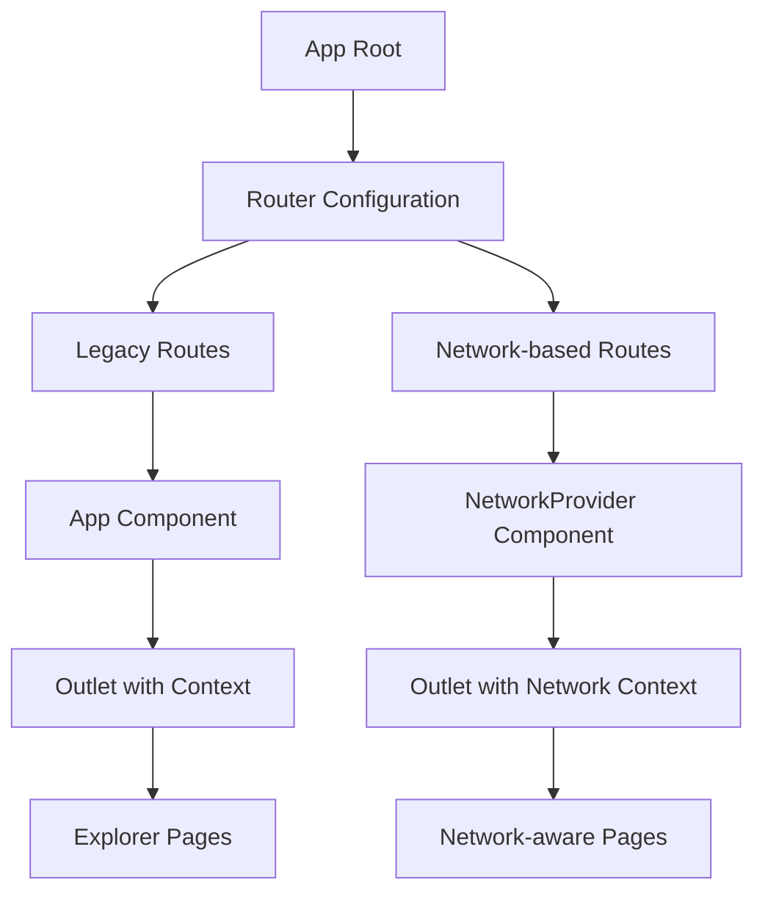

# Implementation Plan: URL-based Network Navigation for Alkanes Explorer

## Architecture Overview

This implementation plan outlines the step-by-step approach to refactoring the METAGRAPH application to use a URL-based network navigation structure, addressing the race condition issues that occur during network switching.



## Core Components

### 1. Network Provider Component

The `NetworkProvider` component serves as the foundation for the new URL-based network structure:

```jsx
// src/components/providers/NetworkProvider.jsx
import React from 'react';
import { useParams, Outlet, Link } from 'react-router-dom';
import { LaserEyesProvider } from '@omnisat/lasereyes';
import NetworkNav from '../shared/NetworkNav';
import WalletConnector from '../shared/WalletConnector';
import BlockHeight from '../shared/BlockHeight';
import { mapNetworkToLaserEyes } from '../../utils/networkMapping';

const NetworkProvider = () => {
  // Get network from URL parameters
  const { network } = useParams();
  
  // Validate network parameter
  const validNetworks = ['mainnet', 'regtest', 'oylnet'];
  const validNetwork = validNetworks.includes(network) ? network : 'mainnet';

  return (
    <LaserEyesProvider config={{ network: mapNetworkToLaserEyes(validNetwork) }}>
      <div className="app">
        <header className="header">
          <div className="header-title">
            <h1>METAGRAPH</h1>
            <span className="subtitle">
              Method Exploration, Tool And Graph Renderer for Alkanes Protocol Handling
            </span>
            <Link to="/" style={{ /* styles */ }}>
              /home
            </Link>
          </div>
          <div className="header-controls">
            <NetworkNav currentNetwork={validNetwork} />
            <WalletConnector />
            <BlockHeight network={validNetwork} refreshInterval={10000} />
          </div>
        </header>
        <main className="main-content">
          {/* Pass the network down through context */}
          <Outlet context={{ endpoint: validNetwork }} />
        </main>
      </div>
    </LaserEyesProvider>
  );
};

export default NetworkProvider;
```

### 2. Network Navigation Component

Replace the current `EndpointToggle` with a navigation-based component:

```jsx
// src/components/shared/NetworkNav.jsx
import React from 'react';
import { useLocation, Link } from 'react-router-dom';

const NetworkNav = ({ currentNetwork }) => {
  const location = useLocation();
  
  // Extract the path without the network part to preserve the current page
  const pathWithoutNetwork = location.pathname.replace(/^\/[^\/]+/, '') || '';
  
  // Define the available networks
  const networks = [
    { id: 'regtest', label: 'REGTEST' },
    { id: 'mainnet', label: 'MAINNET' },
    { id: 'oylnet', label: 'OYLNET' }
  ];
  
  return (
    <div className="network-nav">
      <h4>Network:</h4>
      <div className="network-links">
        {networks.map(network => (
          <Link
            key={network.id}
            to={`/${network.id}${pathWithoutNetwork}`}
            className={`network-link ${currentNetwork === network.id ? 'active' : ''}`}
          >
            {network.label}
          </Link>
        ))}
      </div>
    </div>
  );
};

export default NetworkNav;
```

### 3. Updated Route Configuration

Modify the main router configuration to support both legacy and new URL patterns:

```jsx
// src/routes.jsx
import React from 'react';
import { createBrowserRouter } from 'react-router-dom';
import App from './App';
import Home from './pages/Home';
import NetworkProvider from './components/providers/NetworkProvider';
import NetworkHome from './pages/NetworkHome';
import APIMethodPage from './pages/APIMethodPage';
import NotFound from './pages/NotFound';
import ShadowVoutDocs from './pages/ShadowVoutDocs';
import AlkanesBalanceExplorer from './pages/AlkanesBalanceExplorer';
import AlkanesTokensExplorer from './pages/AlkanesTokensExplorer';
import AlkanesTemplatesExplorer from './pages/AlkanesTemplatesExplorer';
import TraceBlockStatusForm from './components/methods/TraceBlockStatusForm';
import SimulateForm from './components/methods/SimulateForm';
import TraceForm from './components/methods/TraceForm';

const router = createBrowserRouter([
  // Legacy routes (for backward compatibility)
  {
    path: '/',
    element: <App />,
    children: [
      {
        index: true,
        element: <Home />
      },
      {
        path: 'api-methods/:methodId',
        element: <APIMethodPage />
      },
      {
        path: 'docs/shadow-vout',
        element: <ShadowVoutDocs />
      },
      {
        path: 'api-methods/trace',
        element: <APIMethodPage methodComponent={TraceForm} methodName="Trace" />
      },
      {
        path: 'api-methods/traceblockstatus',
        element: <APIMethodPage methodComponent={TraceBlockStatusForm} methodName="Trace Block Status" />
      },
      {
        path: 'api-methods/simulate',
        element: <APIMethodPage methodComponent={SimulateForm} methodName="Simulate Transaction" />
      },
      {
        path: 'explorer/alkanesTokens',
        element: <AlkanesTokensExplorer />
      },
      {
        path: 'explorer/alkanesTemplates',
        element: <AlkanesTemplatesExplorer />
      },
      {
        path: 'explorer/alkanesBalance',
        element: <AlkanesBalanceExplorer />
      }
    ]
  },
  
  // New network-explicit routes
  {
    path: '/:network',
    element: <NetworkProvider />,
    children: [
      {
        index: true,
        element: <NetworkHome />
      },
      {
        path: 'alkanes/tokens',
        element: <AlkanesTokensExplorer />
      },
      {
        path: 'alkanes/balance/:address?',
        element: <AlkanesBalanceExplorer />
      },
      {
        path: 'alkanes/templates',
        element: <AlkanesTemplatesExplorer />
      },
      {
        path: 'api-methods/trace',
        element: <APIMethodPage methodComponent={TraceForm} methodName="Trace" />
      },
      {
        path: 'api-methods/traceblockstatus',
        element: <APIMethodPage methodComponent={TraceBlockStatusForm} methodName="Trace Block Status" />
      },
      {
        path: 'api-methods/simulate',
        element: <APIMethodPage methodComponent={SimulateForm} methodName="Simulate Transaction" />
      }
    ]
  },
  {
    path: '*',
    element: <NotFound />
  }
]);

export default router;
```

### 4. Enhanced SDK Functions with AbortController Support

Update the Alkanes SDK functions to support request cancellation:

```jsx
// src/sdk/alkanes.js - Example update for getAllAlkanes
export const getAllAlkanes = async (limit, offset = 0, endpoint = 'regtest', signal) => {
  try {
    // Input validation
    if (!limit || typeof limit !== 'number' || limit <= 0) {
      throw new Error('Invalid limit parameter: must be a positive number');
    }

    if (limit > 1000) {
      throw new Error('Limit exceeds maximum allowed value (1000)');
    }

    // Get the provider
    const provider = getProvider(endpoint);
    console.log(`Getting ${limit} Alkanes tokens starting from offset ${offset} with ${endpoint} endpoint`);
    
    // Ensure provider.alkanes exists and has the getAlkanes method
    if (!provider.alkanes || typeof provider.alkanes.getAlkanes !== 'function') {
      throw new Error('Alkanes getAlkanes method not available');
    }
    
    // Create fetch options with the AbortController signal if provided
    const options = signal ? { signal } : undefined;
    
    // Call the getAlkanes method with options
    const result = await provider.alkanes.getAlkanes({
      limit,
      offset
    }, options);
    
    // Transform tokens to a consistent format and filter out tokens with invalid names
    const transformedTokens = result
      .filter(token => token.name) // Skip tokens with no name
      .map(token => ({
        // Token mapping code...
      }));
      
    // Return in a consistent format with other API functions
    return {
      status: "success",
      message: "Alkanes tokens retrieved",
      pagination: {
        limit,
        offset,
        total: estimatedTotal // Use our estimated total instead of just the current page count
      },
      tokens: transformedTokens
    };
  } catch (error) {
    // Handle AbortError separately
    if (error.name === 'AbortError') {
      console.log('Request was aborted');
      throw error; // Re-throw to let the component handle it
    }
    
    console.error('Error getting Alkanes tokens:', error);
    return {
      status: "error",
      message: error.message || "Unknown error",
      pagination: {
        limit,
        offset
      },
      tokens: []
    };
  }
};

// Update other SDK functions similarly...
```

### 5. Updated Page Components with Request Cancellation

Example of how to update the Alkanes Tokens Explorer to handle request cancellation:

```jsx
// src/pages/AlkanesTokensExplorer.jsx
import React, { useState, useEffect, useRef } from 'react';
import { useOutletContext, useParams } from 'react-router-dom';
import { getAllAlkanes } from '../sdk/alkanes';

const AlkanesTokensExplorer = () => {
  // Get network from context (legacy) or URL params (new structure)
  const { endpoint = 'mainnet' } = useOutletContext() || {};
  const { network } = useParams();
  
  // Use URL network param first, fall back to context
  const activeNetwork = network || endpoint || 'mainnet';
  
  // State variables
  const [tokens, setTokens] = useState([]);
  const [loading, setLoading] = useState(true);
  const [error, setError] = useState(null);
  const [currentPage, setCurrentPage] = useState(1);
  const [totalTokens, setTotalTokens] = useState(0);
  const tokensPerPage = 30;
  
  // Track the request controller for cancellation
  const abortControllerRef = useRef(null);
  
  // Fetch tokens when component mounts or network/page changes
  useEffect(() => {
    fetchTokens();
    
    // Cleanup function to cancel pending requests when unmounting
    // or when dependencies change (network, page)
    return () => {
      if (abortControllerRef.current) {
        abortControllerRef.current.abort();
      }
    };
  }, [currentPage, activeNetwork]);
  
  // Function to fetch tokens with pagination and cancellation
  const fetchTokens = async () => {
    setLoading(true);
    setError(null);
    
    // Cancel any previous in-flight request
    if (abortControllerRef.current) {
      abortControllerRef.current.abort();
    }
    
    // Create a new abort controller for this request
    abortControllerRef.current = new AbortController();
    
    try {
      const offset = (currentPage - 1) * tokensPerPage;
      
      // Pass the abort signal to the SDK function
      const result = await getAllAlkanes(
        tokensPerPage, 
        offset, 
        activeNetwork, 
        abortControllerRef.current.signal
      );
      
      // Only update state if the request wasn't aborted
      if (!abortControllerRef.current.signal.aborted) {
        if (result.status === 'error') {
          throw new Error(result.message || 'Failed to fetch Alkanes tokens');
        }
        
        setTokens(result.tokens || []);
        
        // Set total tokens count for pagination
        if (result.pagination && result.pagination.total) {
          setTotalTokens(result.pagination.total);
        } else if (result.tokens && result.tokens.length === tokensPerPage) {
          // If we got a full page, there might be more
          setTotalTokens((currentPage * tokensPerPage) + tokensPerPage);
        } else {
          // If we got less than a full page, we're probably at the end
          setTotalTokens((currentPage - 1) * tokensPerPage + (result.tokens ? result.tokens.length : 0));
        }
      }
    } catch (err) {
      // Only update error state if the request wasn't aborted
      if (err.name !== 'AbortError' && !abortControllerRef.current.signal.aborted) {
        console.error('Error fetching Alkanes tokens:', err);
        setError(err.message || 'An error occurred while fetching tokens');
      }
    } finally {
      // Only update loading state if the request wasn't aborted
      if (abortControllerRef.current && !abortControllerRef.current.signal.aborted) {
        setLoading(false);
      }
    }
  };
  
  // Rest of component remains the same...
  
  return (
    <div style={styles.container} className="container">
      <h2 style={styles.title}>Alkanes Tokens Explorer</h2>
      <p style={styles.description}>
        Explore all initialized Alkanes tokens on the {activeNetwork.toUpperCase()} network.
      </p>
      
      {/* Display content based on loading/error/data states */}
      {/* ... */}
    </div>
  );
};

export default AlkanesTokensExplorer;
```

### 6. New Network Home Component

Create a dedicated home component for network-specific views:

```jsx
// src/pages/NetworkHome.jsx
import React from 'react';
import { useParams, Link } from 'react-router-dom';

const NetworkHome = () => {
  const { network } = useParams();
  
  return (
    <div className="network-home container">
      <h1>{network.toUpperCase()} Network Dashboard</h1>
      
      <section className="card-section">
        <h2>Alkanes Resources</h2>
        <div className="resource-cards">
          <div className="resource-card">
            <h3>Tokens</h3>
            <p>Explore all Alkanes tokens on {network}</p>
            <Link to={`/${network}/alkanes/tokens`} className="btn btn-primary">
              View Tokens
            </Link>
          </div>
          
          <div className="resource-card">
            <h3>Balance Explorer</h3>
            <p>Check Alkanes token balances for addresses</p>
            <Link to={`/${network}/alkanes/balance`} className="btn btn-primary">
              Check Balances
            </Link>
          </div>
          
          <div className="resource-card">
            <h3>Templates</h3>
            <p>Explore Alkanes contract templates</p>
            <Link to={`/${network}/alkanes/templates`} className="btn btn-primary">
              View Templates
            </Link>
          </div>
        </div>
      </section>
      
      <section className="card-section">
        <h2>API Methods</h2>
        <div className="resource-cards">
          <div className="resource-card">
            <h3>Trace</h3>
            <p>Trace Alkanes transactions</p>
            <Link to={`/${network}/api-methods/trace`} className="btn btn-primary">
              Go to Trace
            </Link>
          </div>
          
          <div className="resource-card">
            <h3>Simulate</h3>
            <p>Simulate Alkanes transactions</p>
            <Link to={`/${network}/api-methods/simulate`} className="btn btn-primary">
              Go to Simulate
            </Link>
          </div>
        </div>
      </section>
    </div>
  );
};

export default NetworkHome;
```

## Implementation Timeline

### Phase 1: Foundation (Days 1-2)

1. Create the `NetworkProvider` component
2. Create the `NetworkNav` component
3. Update the router configuration to support dual URL patterns
4. Create the `NetworkHome` component

### Phase 2: SDK Enhancement (Days 3-4)

1. Add AbortController support to all SDK functions:
   - `getAllAlkanes`
   - `getAlkanesByAddress`
   - `getAlkanesTokenImage`
   - `traceTransaction`
   - `performAlkanesSimulation`
   - `traceBlock`

2. Update the `getProvider` function to handle cancellation

### Phase 3: Page Adaptation (Days 5-7)

1. Update each page component with request cancellation:
   - `AlkanesTokensExplorer`
   - `AlkanesBalanceExplorer`
   - `AlkanesTemplatesExplorer`
   - `APIMethodPage` and method components

2. Add network-aware navigation to each page

### Phase 4: Testing and Refinement (Days 8-9)

1. Test all network switching scenarios:
   - Direct URL navigation
   - Network switching with links
   - Back/forward browser navigation
   - Rapid network switching

2. Performance testing:
   - Measure load times for each page
   - Monitor memory usage during network switching

3. UX testing:
   - Verify navigation clarity
   - Check loading indicators
   - Test error states

### Phase 5: Documentation and Deployment (Day 10)

1. Update application documentation
2. Create user guides for the new URL structure
3. Deploy to staging environment for final validation
4. Deploy to production

## Migration Strategy

### Backward Compatibility

The implementation maintains backward compatibility through:

1. Dual route structure supporting both legacy and new URL patterns
2. Component logic that handles both context-based and URL-based network parameters
3. Gradual routing of users from old URLs to new URLs

### User Education

1. Add banner notifications on legacy URLs informing users about the new structure
2. Update documentation with examples of new URL patterns
3. Ensure all internal links use the new URL structure

### Redirect Strategy

Implement URL redirects to guide users to the new structure:

```jsx
// src/App.jsx - Add redirect logic
import { useEffect } from 'react';
import { useNavigate, useLocation } from 'react-router-dom';

function App() {
  const navigate = useNavigate();
  const location = useLocation();
  const { endpoint = 'mainnet' } = useOutletContext() || {};
  
  useEffect(() => {
    // Check if this is a legacy explorer URL
    if (location.pathname.startsWith('/explorer/alkanes')) {
      // Extract the resource type
      const resourceType = location.pathname.replace('/explorer/', '');
      
      // Map to new URL structure
      const mappings = {
        'alkanesTokens': `/${endpoint}/alkanes/tokens`,
        'alkanesBalance': `/${endpoint}/alkanes/balance`,
        'alkanesTemplates': `/${endpoint}/alkanes/templates`
      };
      
      if (mappings[resourceType]) {
        // Redirect to new URL structure
        navigate(mappings[resourceType], { replace: true });
      }
    }
  }, [location.pathname, endpoint]);
  
  // Rest of App component...
}
```

## Testing Strategy

### Unit Tests

1. Test `NetworkProvider` component:
   - Verify it correctly reads the network from URL
   - Ensure it provides the right context to children

2. Test `NetworkNav` component:
   - Verify it generates correct links
   - Test that it preserves the current path when switching networks

3. Test SDK functions with AbortController:
   - Verify they handle abort signals correctly
   - Test error handling for aborted requests

### Integration Tests

1. Test network switching flows:
   - Verify data loading is canceled when switching networks
   - Ensure proper state is maintained during navigation

2. Test page component behavior:
   - Verify loading states
   - Test error handling
   - Check that abort controller is properly cleaned up

### End-to-End Tests

1. Test the complete user flow:
   - Navigate to a network page
   - Load data
   - Switch networks
   - Verify data corresponds to the correct network

2. Test the race condition scenario:
   - Rapidly switch between networks
   - Verify the correct data is always displayed

## Conclusion

This implementation plan provides a comprehensive approach to introducing a URL-based network navigation structure in the METAGRAPH application, focused on Alkanes resources. The plan addresses the critical race condition issue while enhancing the application's usability and developer experience.

By following this step-by-step approach, the development team can systematically implement the changes while maintaining backward compatibility and ensuring a smooth transition for users.