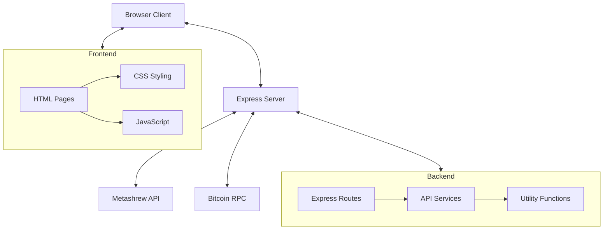

# System Patterns

## Architecture Overview



## Component Relationships

### Server Layer
- **Express Application**: Central routing and middleware configuration
- **API Proxy**: Routes client requests to Metashrew API
- **Status Endpoints**: Provides application health and API connection status
- **Static File Server**: Serves frontend assets

### Service Layer
- **metashrew-api.ts**: Core service for making JSON-RPC calls to Metashrew
- **alkanes-trace.ts**: Specialized service for trace-related functionality
- **Utility Services**: Helper functions for data transformation and validation

### Client Layer
- **HTML Templates**: Page structures for different explorer views
- **JavaScript Modules**: Client-side functionality for API interaction
- **CSS Styling**: Minimal, function-focused design system

## Key Design Patterns

### API Client Pattern
```typescript
// Centralized API client with consistent error handling
export async function callMetashrewApi(method: string, params: any[] = []): Promise<any> {
  try {
    const response = await apiClient.post('', {
      method,
      params,
      id: 0,
      jsonrpc: '2.0'
    });

    if (response.data.error) {
      throw new Error(`Metashrew API Error: ${response.data.error.message}`);
    }

    return response.data.result;
  } catch (error) {
    // Standardized error handling
    console.error(`API call to ${method} failed:`, error);
    throw error;
  }
}
```

### Proxy Pattern
The server acts as a proxy between the client and Metashrew API, allowing for:
- Request normalization
- Error handling
- Security enhancement
- Response transformation

### Observer Pattern
The UI implements an observer pattern for API status with:
- Periodic polling for updates
- Event-based updates on user actions
- Consistent state display across components

## Data Flow

### API Status Flow
1. Client requests status via `/api/status` endpoint
2. Server makes direct calls to Metashrew API
3. Server transforms and combines responses
4. Client displays formatted data and sync status

### Transaction Trace Flow
1. User submits transaction ID
2. Client sends to server's trace endpoint
3. Server calls Metashrew API's trace method
4. Server processes binary trace data
5. Client renders visualization of trace steps

## Error Handling Strategy

### Server-Side
- Catch and log all API errors
- Provide fallback methods when primary calls fail
- Return standardized error responses to client
- Monitor API connection status

### Client-Side
- Display user-friendly error messages
- Provide retry mechanisms for failed requests
- Show detailed technical information in collapsible sections
- Visual indicators for API status
