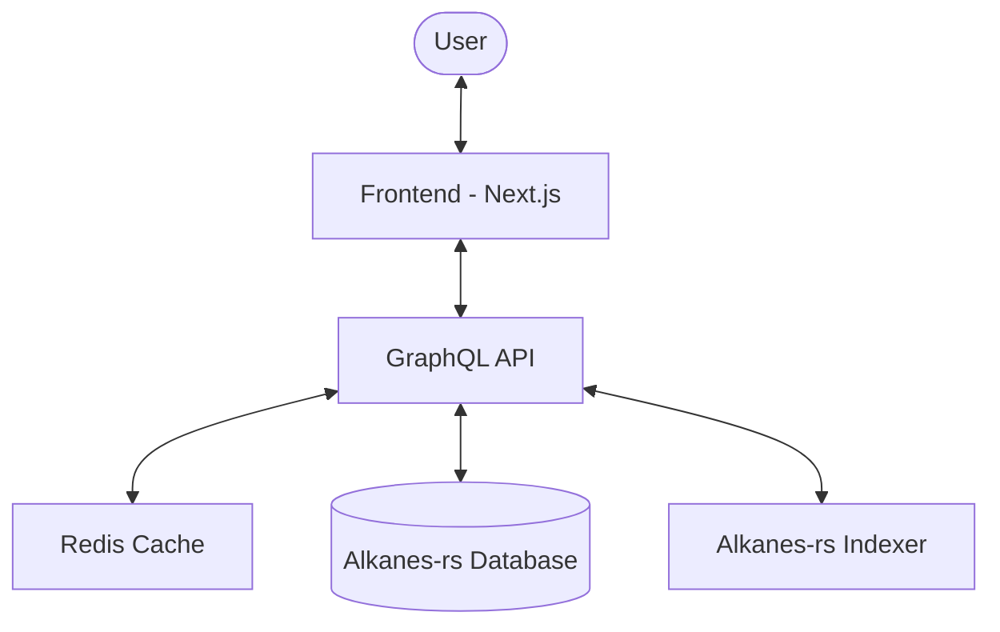
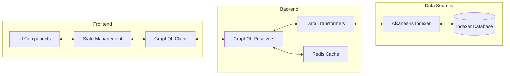

# System Patterns

## System Architecture
The Alkanes Explorer follows a modern web application architecture with several key components:



### Key Components
1. **Frontend Layer**: Next.js application serving as the user interface
2. **API Layer**: GraphQL service providing data access and transformation
3. **Cache Layer**: Redis for performance optimization
4. **Data Source**: Direct connection to the alkanes-rs indexer database

## Design Patterns

### Frontend Patterns
1. **Container/Presentation Pattern**: Separation of data fetching logic from UI components
2. **Virtual Lists**: For efficient rendering of large datasets
3. **Progressive Loading**: Loading critical data first, then enhancing with additional details
4. **Responsive Design**: Adaptable layouts for various screen sizes
5. **Type-Safe Development**: Strict TypeScript implementation for reliability

### Backend Patterns
1. **GraphQL Schema-First Design**: Defining data requirements before implementation
2. **Efficient API Communications**: Optimized queries to the alkanes-rs backend
3. **Error Boundary Pattern**: Comprehensive error handling with fallbacks
4. **Batch Processing**: Using multicall for efficient data retrieval
5. **Comprehensive Logging**: For monitoring and debugging

## Testing Methodology

### API Testing Scripts
1. **Template-Based Testing**: All API methods follow a standardized template for testing
   ```mermaid
   flowchart TD
       BaseTemplate[template-method.sh] --> ViewTemplate[protorunesbyaddress.sh]
       BaseTemplate --> DirectTemplate[metashrew_height.sh]
       ViewTemplate --> MoreViewMethods[Other View Methods]
       DirectTemplate --> MoreDirectMethods[Other Direct Methods]
   ```

2. **Script Structure Pattern**:
   ```
   ├── Configuration Section
   │   ├── Method configuration
   │   └── Default parameter values
   ├── Help Function
   │   └── Command-line options documentation
   ├── Parameter Parsing
   │   └── Command-line argument handling
   ├── Parameter Encoding
   │   └── Method-specific encoding logic
   ├── Request Building
   │   └── JSON-RPC request construction
   ├── Display Information
   │   └── User-friendly output
   └── Request Execution
       └── API call and response handling
   ```

3. **Endpoint Configuration**: All scripts support both local and production endpoints:
   - Production: https://mainnet.sandshrew.io/v2/lasereyes
   - Local: http://localhost:8080

### Testing Strategy
1. **Unit Testing**: Individual components tested in isolation
2. **Integration Testing**: Component interactions verified
3. **End-to-End Testing**: Full user flows tested

## Component Relationships

### Data Flow


### Key Interactions
1. **UI to GraphQL**: Components request data through typed GraphQL queries
2. **Data Transformation**: Raw indexer data is transformed into UI-friendly formats
3. **Caching Layer**: Frequently accessed data is cached for performance
4. **Real-time Updates**: New block data triggers selective UI updates

## Technical Decisions

### Direct Indexer Integration
The explorer connects directly to the alkanes-rs database rather than using intermediate APIs, providing:
- Reduced latency
- Direct access to complete dataset
- Flexibility in data querying

### GraphQL Implementation
GraphQL was chosen over REST for:
- Precise data fetching with minimal over-fetching
- Strong typing for frontend-backend contract
- Efficient batching of multiple data requirements

### Next.js Framework
Selected for:
- Server-side rendering capabilities for SEO and performance
- API routes for backend functionality
- TypeScript integration
- Built-in routing system

### Caching Strategy
Multi-tiered approach with:
- In-memory caching for frequently accessed data
- Redis for distributed caching across service instances
- Browser caching for static assets

## Cross-Cutting Concerns

### Performance Optimization
1. **Query Optimization**: Efficient database queries with proper indexing
2. **Data Pagination**: Chunked data loading for large datasets
3. **Lazy Loading**: Defer loading of non-critical components

### Security Measures
1. **Rate Limiting**: Protection against excessive API requests
2. **Input Validation**: Thorough validation of all user inputs
3. **CORS Policies**: Appropriate cross-origin restrictions

### Monitoring and Observability
1. **Performance Metrics**: Tracking API response times and resource usage
2. **Error Tracking**: Comprehensive error logging
3. **Usage Analytics**: Understanding user patterns for optimization
