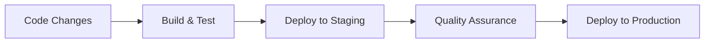

# Technical Context

## Technologies Used

### Frontend
- **Framework**: Next.js 
- **Language**: TypeScript
- **Styling**: Tailwind CSS
- **State Management**: React Context API / Redux (TBD)
- **Data Fetching**: Apollo GraphQL Client
- **Visualization**: D3.js / Chart.js (TBD)
- **Component Libraries**: Headless UI / Radix UI (TBD)

### Backend
- **API**: Node.js GraphQL service
- **Language**: TypeScript
- **GraphQL Implementation**: Apollo Server
- **Caching**: Redis
- **Data Source**: Metashrew JSON-RPC API
- **Protobuf Handling**: protobufjs for binary encoding/decoding
- **Batch Processing**: Custom DataLoader implementation for sandshrew_multicall
- **Authentication**: JWT (if needed)

### Infrastructure
- **Containerization**: Docker
- **Deployment**: Docker Compose for development, Kubernetes for production (TBD)
- **CI/CD**: GitHub Actions (TBD)
- **Monitoring**: Prometheus/Grafana (TBD)

## Development Setup

### Prerequisites
- Node.js (LTS version)
- Docker and Docker Compose
- Access to Metashrew JSON-RPC service
- Redis (for caching)
- Protocol Buffers compiler (for development)

### Local Development Environment
```bash
# Clone the repository
git clone <repository-url>

# Install dependencies
cd alkanes-explorer
npm install

# Set up environment variables
cp .env.example .env
# Edit .env with local configuration

# Start development server
npm run dev
```

### Docker Development
```bash
# Build and start all services
docker-compose up -d

# View logs
docker-compose logs -f

# Check Metashrew indexer status
curl -X POST -H "Content-Type: application/json" --data '{"jsonrpc":"2.0","method":"metashrew_height","params":[],"id":1}' http://localhost:8080
```

## Metashrew API Integration

### JSON-RPC Interface
- Base endpoint typically at `http://localhost:8080` or configured domain
- Standard JSON-RPC 2.0 format for all requests
- Authentication via API key headers (if required)

### View Function Access Methods
1. **JSON-formatted API Functions**: 
   - Functions in the alkanes_* namespace translate between binary protobuf and JSON
   - Example: `alkane_inventory`, `protorunesbyaddress`
   - Easier to implement but limited to explicitly exported functions

2. **Direct Protobuf Access**:
   - Required for functions like `multisimulate` and `traceblock` (not in alkanes_* namespace)
   - Must encode/decode protobuf binary format directly
   - More complex implementation but provides access to all capabilities
   - Implementation references:
     - TypeScript: Check `alkanes/src.ts/rpc.ts` for protobuf handling patterns
     - Rust: See alkanes-rs repository

### Batch Processing Strategies
1. **Multi-request Batching** (sandshrew_multicall):
   ```typescript
   const batchRequests = [
     ["metashrew_height", []],
     ["btc_getblockcount", []],
     ["metashrew_view", ["protorunesbyheight", "0x01000000", "latest"]]
   ];
   
   // Single request containing multiple calls
   const results = await rpcClient.call("sandshrew_multicall", [batchRequests]);
   ```

2. **Range Processing** (multisimulate):
   ```typescript
   // Example for analyzing 1000 Alkanes at a time
   const processBatch = async (startId: number, count: number = 1000) => {
     // Create request array in format [2, n] for each alkane
     // Implement protobuf encoding based on alkanes/src.ts/rpc.ts
     // Call metashrew_view directly with "multisimulate"
   };
   ```

3. **Block Range Analysis** (traceblock):
   ```typescript
   // Process multiple blocks in a single batch request
   const processBlockRange = async (startBlock: number, endBlock: number) => {
     const calls = [];
     for (let height = startBlock; height <= endBlock; height++) {
       const heightHex = "0x" + height.toString(16).padStart(8, '0');
       calls.push(["metashrew_view", ["traceblock", heightHex, "latest"]]);
     }
     return await rpcClient.call("sandshrew_multicall", [calls]);
   };
   ```

### Sync Status Monitoring
```typescript
const getSyncStatus = async () => {
  const [indexerHeight, nodeHeight] = await Promise.all([
    rpcClient.call("metashrew_height", []),
    rpcClient.call("btc_getblockcount", [])
  ]);
  
  return {
    indexerHeight,
    nodeHeight,
    blocksRemaining: nodeHeight - indexerHeight,
    syncPercentage: (indexerHeight / nodeHeight) * 100
  };
};
```

## Technical Constraints

### Metashrew Integration
- Must handle binary protobuf format for direct `metashrew_view` calls
- Need to implement efficient batching strategies for various data access patterns
- Performance considerations when processing large block ranges or Alkane batches
- Need to handle potential binary format changes in future indexer versions

### Protobuf Handling
- Requires proper encoding/decoding of complex binary formats
- Must match the exact protobuf definitions from alkanes-rs
- Need to handle versioning and compatibility with future changes
- Performance considerations for binary data processing

### Browser Compatibility
- Support for modern browsers (Chrome, Firefox, Safari, Edge)
- Mobile responsiveness requirements
- Potential limitations with complex visualizations on mobile devices

### Security Considerations
- Handling of public blockchain data without exposing sensitive system details
- Protection against common web vulnerabilities
- Rate limiting to prevent abuse of batch processing capabilities
- Careful handling of user-supplied inputs for contract simulation

### Performance Requirements
- Fast loading times for main pages (<2s target)
- Efficient handling of large transaction lists
- Responsive UI even when processing complex data
- Optimal batch sizes for different API operations
- Caching strategy for frequently accessed data

## Dependencies

### Direct Dependencies
- Metashrew JSON-RPC service
- Redis for caching
- Node.js runtime
- protobufjs library
- DataLoader for batching

### External APIs
- None required for core functionality
- Potential integration with price APIs or other external data sources in future phases

### Third-Party Services
- No critical third-party service dependencies
- May utilize analytics and monitoring services

## Development Workflow

### Version Control
- Git for source control
- Feature branch workflow
- Pull request reviews before merging to main branch

### Testing Strategy
- Unit tests for core logic and protobuf handling
- Integration tests for API endpoints and batch processing
- End-to-end tests for critical user journeys
- Visual regression testing for UI components
- Performance testing for batch operations

### Deployment Pipeline


## Technical Debt Management

### Known Areas for Improvement
- Initial implementation may need optimization for very large datasets
- Early versions may have simplified visualizations to be enhanced later
- Initial test coverage may be focused on core functionality
- First iteration may use simplified protobuf handling for some operations

### Technical Debt Strategy
- Regular refactoring sprints
- Documentation of tech debt items
- Prioritization based on user impact
- Gradual optimization of batch processing strategies

## System Resources

### Compute Requirements
- Moderate CPU requirements for GraphQL and protobuf processing
- Memory requirements dependent on caching strategy and batch sizes
- Storage requirements minimal for application (excluding database)
- Network capacity for frequent RPC communication with Metashrew service
